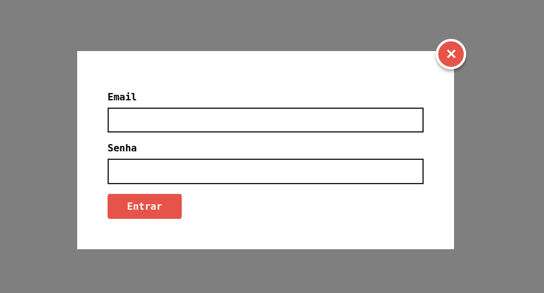

# Modal

Uma Modal feita com CSS/JavaScript puro, sendo reutilizável através de classes(ES6).

## Exemplo de Utilização

- Baixe os assets presentes na pasta **./dist**.
- Inclua junto os assets em uma pasta de sua preferência


**Imagem:**



**Código:**

```html
<button data-modal="abrir">Abrir modal</button>
<section class="modal-container" data-modal="container">
  <div class="modal">
    <button data-modal="fechar" class="fechar"></button>
    <form action="">
      <label for="email">Email</label>
      <input type="text" name="email" id="email" />
      <label for="senha">Senha</label>
      <input type="password" name="senha" id="senha" />
      <button type="submit">Entrar</button>
    </form>
  </div>
</section>
<script>
  // Primeiro parâmetro: Botão responsável por abrir a modal
  // Segundo parâmetro: Botão responsável por fechar a modal
  // Terceiro parâmetro: Container da Modal, contendo o overlay
  const modal = new Modal(
    '[data-modal="abrir"]',
    '[data-modal="fechar"]',
    '[data-modal="container"]'
  );
  modal.init();
</script>
```

## Testar Utilização

Para testar a utilização: É possível através do arquivo **./exemplo.html**

Para desenvolver: Utilize o arquivo **./index.html**

## Estilização

Para melhor capacidade de estilização, o CSS não está minificado, permitindo
ser customizado com facilidade.

Para modificar o estilo da Modal, edite o estilo na pasta **./dist**

## Funcionamento

A modal possui somente o estilo básico para seu funcionamento,
demais estilos devem ser feitos de acordo com a necessidade.
